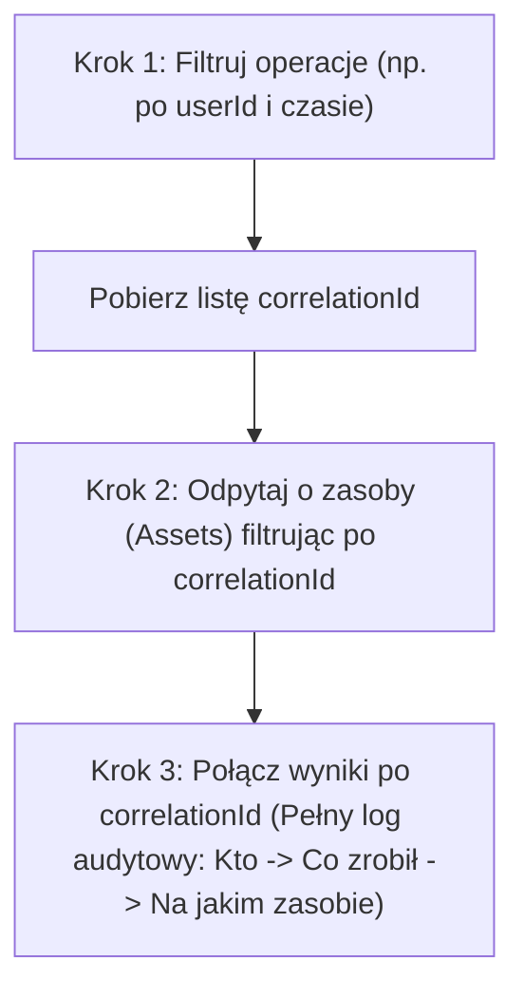

# 🎯 Definicja
**Audit API** to dedykowany interfejs GraphQL w module Audytu (Audit module) [[Ataccama|Ataccama]] ONE. Służy do śledzenia i pobierania historii wszystkich działań podejmowanych przez użytkowników w systemie (odczyty, edycje, usunięcia) oraz prób nieautoryzowanego dostępu w celach bezpieczeństwa i zgodności z regulacjami (compliance).

---

# 🔑 Kluczowe punkty
- Działa na osobnym porcie (domyślnie **8071**) i korzysta z oddzielnej [[Bazy danych|bazy danych]] PostgreSQL (nie wpływa na wydajność głównego repozytorium metadanych).
- Rejestruje dwa typy rekordów: **Operacje** (kto i co zrobił) oraz **Zasoby** (do jakich obiektów uzyskano dostęp).
- Powiązanie operacji z zasobami odbywa się za pomocą klucza **`correlationId`**.
- Uwierzytelnianie dzieli wspólny realm [[Keycloak|Keycloak]]; użytkownik wywołujący to API musi posiadać rolę `AUDIT_admin` lub `AUDIT_user` (patrz: [[Endpoints and HTTP Headers|Uwierzytelnianie]]).
- Zapytania do Audit API (patrz: [[One API Queries]]) powinny zawsze zawierać filtry czasowe (czas uniksowy w milisekundach), aby uniknąć pełnego skanowania tabeli.

---

# 📚 Szczegółowe wyjaśnienie i architektura

### Różnice architektoniczne:

| Atrybut | Główne ONE API | Audit API |
| :--- | :--- | :--- |
| **Protokół** | GraphQL | GraphQL |
| **Punkt Końcowy (Endpoint)** | `http://host:8080/graphql` (patrz: [[Endpoints and HTTP Headers]]) | `http://host:8071/graphql` |
| **Baza danych** | Repozytorium metadanych ONE | Oddzielna baza PostgreSQL |
| **Dane** | Obiekty ładu danych (Governance) | Wyłącznie wpisy o zdarzeniach (eventy) |
| **Konfiguracja** | Moduł `mmm` | Moduł `audit` (`server.port`) |

Domyślnie audytowane encje to: `source`, `location`, `connection`, `credential`, `catalogItem`, `attribute`, `dmmCatalogItem`, `record`.  
Aby włączyć audyt na innych obiektach, należy dodać cechę `audit:auditEnabled` w konfiguracji wybranej encji.

---

### Co dokładnie śledzi moduł audytu?

1. **Operacje (Operations) — co się wydarzyło:**
   - Wyświetlanie (listing), odczyt (read), aktualizacja (update) i usuwanie (delete) zasobów.
   - Niestandardowe operacje (np. [[Profiling|profilowanie]]: `bulkProfile`, testowanie połączeń: `testConnection`, patrz: [[Data Source]]).
   - Naruszenia dostępu (access violations) – logowane, gdy użytkownik nie ma uprawnień lub zasób nie istnieje.
2. **Zasoby (Assets) — czego dotyczyło zdarzenie:**
   - Szczegółowa tożsamość zasobu: `assetId`, `assetName`, `assetType` (np. [[Data Catalog|catalogItem]], [[Data Source|source]], connection).
   - Typ dostępu: `ENTITY` (obiekt metadanych, patrz: [[Metadata]]) lub `LINK` (wskaźnik do Konsoli Administracyjnej DPM).

---

### Struktura rekordu operacji (Operation Record)

| Pole | Typ | Opis |
| :--- | :--- | :--- |
| **module** | String | Moduł źródłowy: MMM, DPM lub DMM |
| **action** | String | Typ zdarzenia: READ, FINISH_SUCCESS, OPERATION |
| **operation** | String | Konkretna operacja: catalogItem, LIST, testConnection, checkCatalogItemDqEval |
| **assetType** | String | Typ zaangażowanej encji: catalogItem (patrz: [[Data Catalog]]), connection, source |
| **assetId** | String | Unikalny identyfikator zasobu, do którego uzyskano dostęp |
| **assetName** | String | Nazwa wyświetlana zasobu |
| **correlationId** | String | Klucz łączący tę operację z powiązanymi rekordami zasobów (Asset) |
| **time** | Long | Czas w milisekundach od epoki Unix (01/01/1970) |
| **userName** | String | Nazwa użytkownika, który wywołał akcję |
| **userId** | String | Unikalny identyfikator użytkownika z [[Keycloak|Keycloak]] |
| **violation** | Boolean | `true`, jeśli akcja została odrzucona przez brak uprawnień |

---

# 💡 Przykłady zapytań GraphQL

#### 1. Pobranie listy wszystkich rekordów operacji (Query):
```graphql
query listOperations {
  operations {
    edges {
      node {
        module
        action
        operation
        assetType
        assetName
        correlationId
        time
        userName
        userId
        violation
      }
    }
  }
}
```

#### 2. Filtrowanie operacji (np. odczyty z modułu MMM dla określonego użytkownika i przedziału czasu):
```graphql
query filterOperations {
  operations(
    modules: ["MMM"]
    userIds: ["716b5f1e-d566-4ec8-bcd8-27a7ff1f53e5"]
    actions: ["READ"]
    operations: ["catalogItem"]
    time: {
      oldest: 1600000000000
      newest: 1800000000000
    }
  ) {
    edges {
      node {
        operation
        action
        assetType
        correlationId
        time
      }
    }
  }
}
```

#### 3. Pobranie listy zasobów (Assets):
```graphql
query listAssets {
  assets {
    edges {
      node {
        correlationId
        assetId
        assetName
        assetType
        type
        action
        violation
        time
      }
    }
  }
}
```

#### 4. Stronicowanie (Pagination) w Audit API
Audit API wykorzystuje stronicowanie oparte na parametrach `skip` (przesunięcie) oraz `size` (rozmiar strony) (porównaj ze standardową paginacją w [[One API Queries]]):
```graphql
query listAssets {
  assets(
    skip: 0
    size: 50
    time: { oldest: 1700000000000, newest: 1800000000000 }
  ) {
    edges {
      node {
        correlationId
        assetName
        action
        time
      }
    }
    pageInfo {
      endCursor
      hasNext
    }
  }
}
```

---

### Metodologia korelacji danych (Operations & Assets)
W celu pełnego zrekonstruowania przebiegu zdarzenia stosuje się schemat korelacji za pomocą klucza `correlationId`:



---

### Pobieranie logów z poziomu [[ONE Desktop|ONE Desktop]]
W celu cyklicznego pobierania logów do zewnętrznych celów analitycznych można użyć kroku **JSON Call** w [[ONE Desktop|ONE Desktop]] (zobacz: [[Desktop JSON Call Step General Configuration]]):
1. **URL:** Skieruj krok na port audytu: `http://host:8071/graphql` (nie na port główny 8080).
2. **Uprawnienia:** Upewnij się, że użytkownik ma rolę `AUDIT_admin` lub `AUDIT_user` w [[Keycloak|Keycloak]].
3. **Szablon Wejściowy (Input Template):** Parametryzuj zapytanie za pomocą dynamicznych zmiennych w formacie `${zmienna}`:
   ```json
   {
     "query": "query listOperations { operations(modules: [\"MMM\"], actions: [\"DELETE\"], time: { oldest: ${fromEpoch}, newest: ${toEpoch} }) { edges { node { operation action assetName correlationId time userName } } } }"
   }
   ```
4. **Konfiguracja Reader (JSON Path):** Ustaw ścieżkę strumienia jako `data.operations.edges[*].node` w celu spłaszczenia struktury GraphQL i przekazania wierszy do zapisu w bazie danych lub pliku CSV.

---

## 📌 Źródła
- [[Ataccama|Ataccama]] ONE Security and Auditing Guide
- [[ONE Desktop|ONE Desktop]] Integration plans repository
